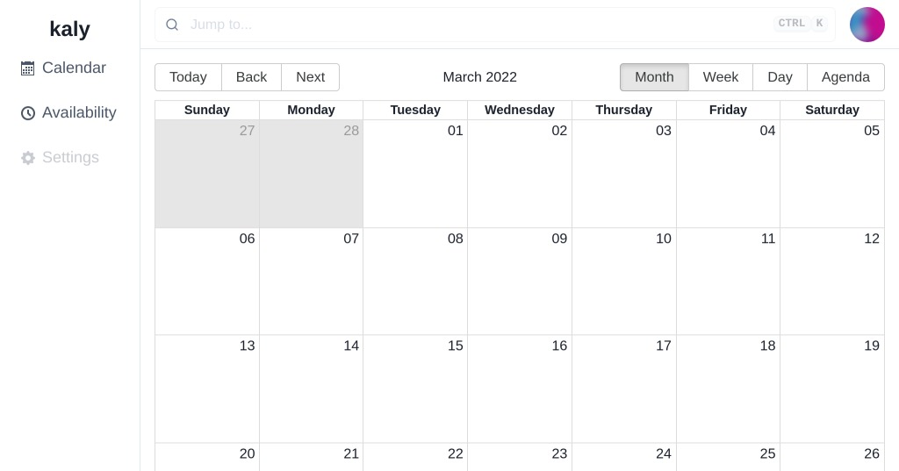

# Kaly

A decentralized calendar and scheduling app built with Ceramic.



### Features

- [x] Web3 login with MetaMask (Self.ID)
- [x] Calendar and events is stored in Ceramic
- [x] Invite attendees with DID, wallet address or ENS (ENS not implemented yet)
- [x] The invited attendees can see these events when they sign in
- [x] The organizer can update their created events
  - [ ] TODO: fix proper DateTimeInput
- [ ] Configure availability
- [ ] Events can be public, private or confidential (encrypted, only invited attendees can decrypt)
- Public events can be shared with a link (`https://kaly.../api/event/:streamId`)
- API endpoint to add your calendar to apps that support iCalendar ((`https://kaly.../api/ical/:did`))
- [x] Markdown for event descriptions
- [x] Keyboard shortcuts
  - 1 - Month view
  - 2 - Week view
  - 3 - Day view
  - 4 - Agenday view
  - R - Previous month / week / day (depends on view)
  - T - Go to today
  - Y - Next month / week / day (depends on view)
  - N - New event from next available time
- [ ] Import ical url into other Calendars (google, apple, microsoft, ...)
- [ ] API integration
  - Use Ceramic definitions to integrate on your own website

### Integration with other projects

```ts
import model from "@kaly/model"; // note: not actually an npm package yet

// Get availablity for eth address, eg a DAO member
await dataStore.get(model.definitions.availability, addressToDid(ethAddress));
{
  availability: {
    rules: [
      {
        type: "wday",
        intervals: [{ from: "09:00", to: "17:00" }],
        wday: "monday",
      },
      ...
    ];
  }
}
```

### Data models

Join the discussion to shape the datamodels: https://github.com/ceramicstudio/datamodels/discussions/34

#### Calendar

#### Event

TBD

#### Availability

TBD

#### Meeting requests

TBD

## Getting Started

First, run the development server:

```bash
npm run dev
# or
yarn dev
```

Open [http://localhost:3000](http://localhost:3000) with your browser.
